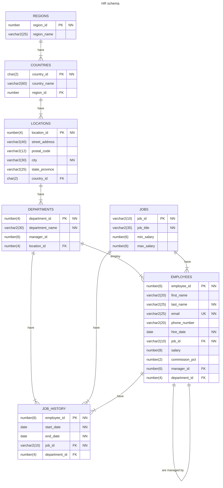

# Sales History Sample Schema

```
Copyright (c) 2023 Oracle and/or its affiliates. All rights reserved.

Permission is hereby granted, free of charge, to any person obtaining a
copy of this software and associated documentation files (the "Software"),
to deal in the Software without restriction, including without limitation
the rights to use, copy, modify, merge, publish, distribute, sublicense,
and/or sell copies of the Software, and to permit persons to whom the
Software is furnished to do so, subject to the following conditions:

The above copyright notice and this permission notice shall be included in
all copies or substantial portions rem of the Software.

THE SOFTWARE IS PROVIDED "AS IS", WITHOUT WARRANTY OF ANY KIND, EXPRESS OR
IMPLIED, INCLUDING BUT NOT LIMITED TO THE WARRANTIES OF MERCHANTABILITY,
FITNESS FOR A PARTICULAR PURPOSE AND NONINFRINGEMENT. IN NO EVENT SHALL
THE AUTHORS OR COPYRIGHT HOLDERS BE LIABLE FOR ANY CLAIM, DAMAGES OR OTHER
LIABILITY, WHETHER IN AN ACTION OF CONTRACT, TORT OR OTHERWISE, ARISING
FROM, OUT OF OR IN CONNECTION WITH THE SOFTWARE OR THE USE OR OTHER
DEALINGS IN THE SOFTWARE.
```

## Description

Sales History `(SH)` schema models a company's sales transactions and reports.
The sample company does a high volume of business, so it runs business
statistics reports to aid in decision making. Many of these reports are
time-based and nonvolatile. That is, they analyze past data trends. The company
loads data into its data warehouse regularly to gather statistics for
these reports. These reports include annual, quarterly, monthly, and weekly
sales figures by product. These reports are stored by using the schema
Sales History (`SH`).

The company also runs reports on distribution channels through which its
sales are delivered. When the company runs special promotions on its products,
it analyzes the impact of the promotions on sales. It also analyzes sales
by geographical area.

### Schema Diagram



### Table Descriptions

#### `COUNTRIES`

| Name           | Null       | Type           |
| -------------- | ---------- | -------------- |
| `COUNTRY_ID`   | `NOT NULL` | `CHAR(2)`      |
| `COUNTRY_NAME` |            | `VARCHAR2(60)` |
| `REGION_ID`    |            | `NUMBER`       |

#### `DEPARTMENTS`

| Name              | Null       | Type           |
| ----------------- | ---------- | -------------- |
| `DEPARTMENT_ID`   | `NOT NULL` | `NUMBER(4)`    |
| `DEPARTMENT_NAME` | `NOT NULL` | `VARCHAR2(30)` |
| `MANAGER_ID`      |            | `NUMBER(6)`    |
| `LOCATION_ID`     |            | `NUMBER(4)`    |

#### `EMPLOYEES`

| Name             | Null       | Type           |
| ---------------- | ---------- | -------------- |
| `EMPLOYEE_ID`    | `NOT NULL` | `NUMBER(6)`    |
| `FIRST_NAME`     |            | `VARCHAR2(20)` |
| `LAST_NAME`      | `NOT NULL` | `VARCHAR2(25)` |
| `EMAIL`          | `NOT NULL` | `VARCHAR2(25)` |
| `PHONE_NUMBER`   |            | `VARCHAR2(20)` |
| `HIRE_DATE`      | `NOT NULL` | `DATE`         |
| `JOB_ID`         | `NOT NULL` | `VARCHAR2(10)` |
| `SALARY`         |            | `NUMBER(8,2)`  |
| `COMMISSION_PCT` |            | `NUMBER(2,2)`  |
| `MANAGER_ID`     |            | `NUMBER(6)`    |
| `DEPARTMENT_ID`  |            | `NUMBER(4)`    |

#### `JOBS`

| Name         | Null       | Type           |
| ------------ | ---------- | -------------- |
| `JOB_ID`     | `NOT NULL` | `VARCHAR2(10)` |
| `JOB_TITLE`  | `NOT NULL` | `VARCHAR2(35)` |
| `MIN_SALARY` |            | `NUMBER(6)`    |
| `MAX_SALARY` |            | `NUMBER(6)`    |

#### `JOB_HISTORY`

| Name            | Null       | Type           |
| --------------- | ---------- | -------------- |
| `EMPLOYEE_ID`   | `NOT NULL` | `NUMBER(6)`    |
| `START_DATE`    | `NOT NULL` | `DATE`         |
| `END_DATE`      | `NOT NULL` | `DATE`         |
| `JOB_ID`        | `NOT NULL` | `VARCHAR2(10)` |
| `DEPARTMENT_ID` |            | `NUMBER(4)`    |

#### `LOCATIONS`

| Name             | Null       | Type           |
| ---------------- | ---------- | -------------- |
| `LOCATION_ID`    | `NOT NULL` | `NUMBER(4)`    |
| `STREET_ADDRESS` |            | `VARCHAR2(40)` |
| `POSTAL_CODE`    |            | `VARCHAR2(12)` |
| `CITY`           | `NOT NULL` | `VARCHAR2(30)` |
| `STATE_PROVINCE` |            | `VARCHAR2(25)` |
| `COUNTRY_ID`     |            | `CHAR(2)`      |

#### `REGIONS`

| Name          | Null       | Type           |
| ------------- | ---------- | -------------- |
| `REGION_ID`   | `NOT NULL` | `NUMBER`       |
| `REGION_NAME` |            | `VARCHAR2(25)` |

### Schema Objects

| Object Type | Objects                                                                                                                                                                                                                                                                                                                                          |
| ----------- | ------------------------------------------------------------------------------------------------------------------------------------------------------------------------------------------------------------------------------------------------------------------------------------------------------------------------------------------------ |
| Index       | `country_c_id_pk`, `dept_id_pk`, `dept_location_ix`, `emp_department_ix`, `emp_email_uk`, `emp_emp_id_pk`, `emp_job_ix`, `emp_manager_ix`, `emp_name_ix`, `jhist_department_ix`, `jhist_employee_ix`, `jhist_emp_id_st_date_pk`, `jhist_job_ix`, `job_id_pk`, `loc_city_ix`, `loc_country_ix`, `loc_id_pk`, `loc_state_province_ix`, `reg_id_pk` |
| Procedure   | `add_job_history`, `secure_dml`                                                                                                                                                                                                                                                                                                                  |
| Sequence    | `departments_seq`, `employees_seq`, `locations_seq`                                                                                                                                                                                                                                                                                              |
| Table       | `countries`, `departments`, `employees`, `jobs`, `job_history`, `locations`, `regions`                                                                                                                                                                                                                                                           |
| Trigger     | `secure_employees`, `update_job_history`                                                                                                                                                                                                                                                                                                         |
| View        | `emp_details_view`                                                                                                                                                                                                                                                                                                                               |

### Schema Version

21.1

### Release Date

06-DEC-2022

### Supported with Database Versions

19c and higher

### Major Changes in this Release

1. All DATE data is updated
2. New install mechanism

### Schema Dependencies and Requirements

- **Requires [SQLcl](https://oracle.com/sqlcl) command prompt!**
- Required access to `sh_install.sql`, `sh_create.sql`, `sh_populate.sql`

## Install Instruction

1. Connect as privileged user with rights to create another user (`SYSTEM`, `ADMIN`, etc.)
2. Run the `sh_install.sql` script to create the `SH` (Sales History) schema
3. You are prompted for:
   1. `password` - enter an Oracle Database compliant password
   2. `tablespace` - if you do not enter a tablespace, the default database tablespace is used

**Note:** If the `SH` schema already exists, it is removed/dropped and
a fresh `SH` schema is installed

## Uninstall Instructions

1. Connect as privileged user with rights to create another user (`SYSTEM`, `ADMIN`, etc.)
2. Run the `SH_uninstall.sql ` script to remove the `SH` (Sales History) schema

## Notes

Scripts need to be run as a privileged user with rights to create and drop another user (`SYSTEM`, `ADMIN`, etc.).
